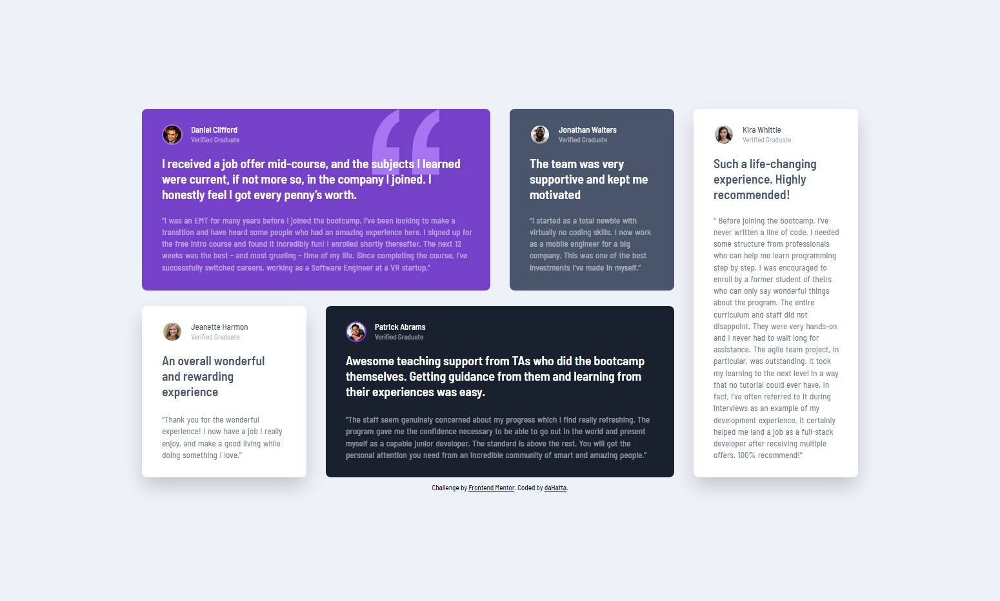

# Frontend Mentor - Testimonials grid section solution

This is my solution to the [Testimonials grid section challenge on Frontend Mentor](https://www.frontendmentor.io/challenges/testimonials-grid-section-Nnw6J7Un7).

## Table of contents

- [Overview](#overview)
  - [The challenge](#the-challenge)
  - [Screenshot](#screenshot)
  - [Links](#links)
- [My process](#my-process)
  - [Built with](#built-with)
  - [What I learned](#what-i-learned)
  - [Continued development](#continued-development)
  - [Useful resources](#useful-resources)
- [Author](#author)

**Note: Delete this note and update the table of contents based on what sections you keep.**

## Overview

### The challenge

Users should be able to:

- View the optimal layout for the site depending on their device's screen size

### Screenshot



### Links

- Solution URL: [Add solution URL here](https://your-solution-url.com)
- Live Site URL: [Add live site URL here](https://your-live-site-url.com)

## My process

### Built with

- Semantic HTML5 markup
- CSS custom properties
- Flexbox
- CSS Grid
- Mobile-first workflow

### What I learned

It was a great lesson about grid and some pseudo-classes.

I used some of the tree-structural pseudo-classes:

```css
.testimonial-card:nth-child(1) {
  grid-column: 1 / 3;
  grid-row: 1 / 2;
}

.testimonial-quote:last-child {
  line-height: 1.4;
}
```

It was also nice to set up a grid with different row heights and gaps:

```css
.testimonial-box {
  gap: 24px 30px;
  grid-template-columns: repeat(4, 255px);
  grid-template-rows: 282px 266px;
  margin-block-start: 0;
}
```

### Continued development

As it was a great exercise to practice grid and flex, i still need some more to do. Next will be something with JS again.

### Useful resources

- [A (more) Modern CSS Reset](https://piccalil.li/blog/a-more-modern-css-reset/) - This article by Andy Bell helped me to reset websites for browser.
- [Google Fonts](https://fonts.google.com/specimen/Barlow+Semi+Condensed) - Font _Barlow Semi Condensed_ used
- [grid](https://developer.mozilla.org/en-US/docs/Web/CSS/grid) - Nice source to learn about grid.
- [flex](https://developer.mozilla.org/en-US/docs/Web/CSS/flex) - Nice source to learn about flex.
- [Pseudo-classes](https://developer.mozilla.org/en-US/docs/Web/CSS/Pseudo-classes) - Nice source to learn about pseudo-classes.

## Author

- Frontend Mentor - [@daHatta](https://www.frontendmentor.io/profile/daHatta)
